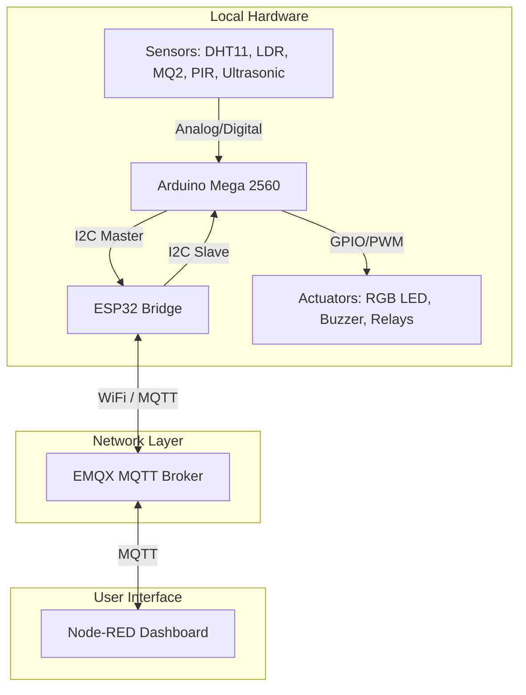

# IoT Smart Home: Environment Monitoring & Automation System

This project is a professional-grade IoT environmental monitoring and home automation system. It features an **Arduino Mega 2560** interfacing with physical sensors and actuators, and an **ESP32** acting as a communication bridge. The system communicates via **I2C** internally and publishes telemetry to an **MQTT broker** (EMQX) for remote monitoring and control through a **Node-RED dashboard**.

---

## 📋 Table of Contents
1. [System Architecture](#-system-architecture)
2. [Hardware Components & Wiring](#-hardware-components--wiring)
3. [MQTT Topic Specifications](#-mqtt-topic-specifications)
4. [Project Structure](#-project-structure)
5. [Getting Started](#-getting-started)
    - [Firmware Setup](#1-firmware-setup)
    - [Node-RED Setup](#2-node-red-setup)
6. [Academic & Lab History](#-academic--lab-history)

---

## 🏗️ System Architecture

The system splits the workload between two microcontrollers to achieve real-time responsiveness and stable internet connectivity:
* **Arduino Mega 2560 (I2C Master)**: Dedicated to high-frequency sensor reading (DHT11, LDR, MQ2, PIR, Ultrasonic) and driving local actuators (Buzzer, Relays, RGB LED).
* **ESP32 (I2C Slave & MQTT Bridge)**: Dedicated to managing the WiFi connection, subscribing to Node-RED commands via MQTT, and publishing telemetry data.



---

## 🔌 Hardware Components & Wiring

### 1. Arduino Mega 2560 Pin Mapping
| Component | Type | Pin | Description |
| :--- | :--- | :---: | :--- |
| **DHT11** | Temperature & Humidity Sensor | `41` | Reads environmental temperature and humidity |
| **PIR Sensor** | Motion Sensor | `31` | Detects human motion for intruder alert |
| **Ultrasonic HC-SR04** | Distance Sensor | `51` (TRIG), `53` (ECHO) | Measures physical proximity/distance |
| **MQ2 Gas Sensor** | Gas & Smoke Sensor | `A7` | Detects gas leakage and smoke particles |
| **LDR Photoresistor** | Ambient Light Sensor | `A0` | Monitors light levels for auto-lighting control |
| **AC Relay** | Actuator Switch | `12` | Turns Air Conditioning simulator on/off |
| **LED Light Relay** | Actuator Switch | `8` | Controls main light simulator |
| **Buzzer** | Alarm Actuator | `11` | Emits active audio alarm when security/gas is tripped |
| **RGB LED** | Actuator Light | `2` (Red), `4` (Green), `6` (Blue) | Custom atmospheric indicator light |

### 2. Microcontroller Inter-Connection (I2C)
Ensure a common ground connection exists between both microcontrollers to avoid communication errors.
* **Arduino Mega 2560** `Pin 20 (SDA)` <---> **ESP32** `GPIO 21 (SDA)`
* **Arduino Mega 2560** `Pin 21 (SCL)` <---> **ESP32** `GPIO 22 (SCL)`
* **Arduino Mega 2560** `GND` <---> **ESP32** `GND`
* **I2C Address**: `0x11`

---

## 📡 MQTT Topic Specifications

Default MQTT Broker: `broker.emqx.io:1883`

### 1. Telemetry Topics (ESP32 ➡️ Node-RED)
| Topic | Payload Format | Description |
| :--- | :--- | :--- |
| `Temp_4` | Float | Real-time Temperature (°C) |
| `Humid_4` | Float | Real-time Humidity (%) |
| `Status_4` | `"true"` / `"false"` | Air Conditioner status |
| `Lux_4` | Float | Ambient Light Level (Lux) |
| `Gas_4` | Float | Gas density reading (PPM) |
| `PIR_4` | `"1"` (Active) / `"0"` (Inactive) | Motion detection alert status |
| `LDR_4` | Float | Ultrasonic distance reading (cm) |
| `tol_4` | `"true"` | Timeout flag |

### 2. Control Topics (Node-RED ➡️ ESP32)
| Topic | Payload Format | Description |
| :--- | :--- | :--- |
| `aop_4` | Float | High temperature threshold to trigger Air Conditioner |
| `aof_4` | Float | Low temperature threshold to turn off Air Conditioner |
| `OnOff_4`| `"true"` / `"false"` | Manual switch to turn LED light relay on/off |
| `Auto_4` | `"true"` / `"false"` | Enable/Disable Auto-Light Mode (based on Lux) |
| `LS_4`   | `"true"` / `"false"` | Turn RGB LED on/off |
| `LC_4`   | JSON `{"r": 0-255, "g": 0-255, "b": 0-255}` | Set custom RGB LED color |
| `Swi_4`  | `"true"` / `"false"` | Enable/Disable intruder Security Mode (PIR-triggered buzzer) |
| `Switch_4`| `"true"` / `"false"` | Enable/Disable Gas Alarm buzzer safety mode |
| `Ledoff_4`| Integer | Off Timer configuration for LED light |

---

## 📁 Project Structure

```
.
├── config/
│   └── node-red-flow.json      # Pre-configured Node-RED flow (translated English UI)
├── firmware/
│   ├── arduino-mega/           # PlatformIO project for Arduino Mega 2560
│   │   ├── src/main.cpp        # Master device logic
│   │   ├── platformio.ini      # Library and board configurations
│   │   └── diagram.json        # Wokwi simulation diagram
│   └── esp32/                  # PlatformIO project for ESP32
│       ├── src/main.cpp        # Slave device + MQTT client logic
│       └── platformio.ini      # WiFi, PubSubClient, & I2C configurations
├── experience/                 # Preserved lab files, coursework, and examples
│   ├── docs/                   # PDF Course lectures (Introduction, Sensors, Node-RED, etc.)
│   ├── tools/                  # Utilities (RFC2217 serial bridge tool)
│   └── [Exercise Folders]      # Previous academic tasks (Blynk, Slave, ThingSpeak, I2C, etc.)
├── .gitignore                  # Global ignore rules for build artifacts
└── README.md                   # This project documentation
```

---

## 🚀 Getting Started

### 1. Firmware Setup
All firmware projects are managed via **PlatformIO**.

1. Install **VS Code** and the **PlatformIO IDE** extension.
2. Open the workspace in VS Code.
3. Open `firmware/esp32/src/main.cpp` and update your network credentials:
   ```cpp
   const char *ssid = "YOUR_WIFI_SSID";
   const char *password = "YOUR_WIFI_PASSWORD";
   ```
4. Connect your **Arduino Mega 2560** and **ESP32** to your PC.
5. In the PlatformIO sidebar, select `arduino-mega` and run **Upload**. Then, select `esp32` and run **Upload**.

### 2. Node-RED Setup
1. Set up a local Node-RED instance or host one online.
2. In the top-right menu of Node-RED, click **Import**.
3. Load the contents of [node-red-flow.json](config/node-red-flow.json).
4. Deploy the flow.
5. Access your dashboard (usually at `http://localhost:1880/ui`) to monitor sensors and toggle switches.

---

## 🎓 Academic & Lab History
To keep this repository clean and focus on the final system implementation, all older lab exercises, homework assignments, serial bridge utilities, and lecture slides have been neatly relocated to the [experience/](experience/) directory. 
- You can find resources regarding **UART/I2C examples**, **ThingSpeak integrations**, **Blynk trials**, and PDF documentation in their respective folders inside `experience/`.
# IoT
